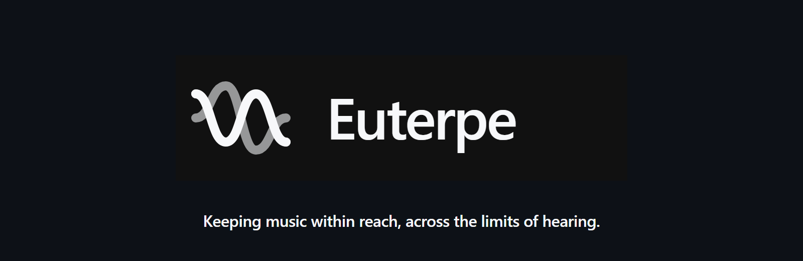
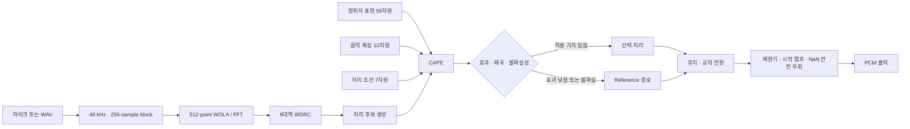

<p align="center">
  <a href="#introduction">
    
  </a>
</p>
<p align="center">
  <br />
  <a href="#introduction"><strong>Introduction</strong></a> ·
  <a href="#msa-select"><strong>MSA-Select</strong></a> ·
  <a href="#architecture"><strong>Architecture</strong></a> ·
  <a href="#validation"><strong>Validation</strong></a>
</p>

<p align="center">
  
  
  
  
</p>

## Introduction

Euterpe는 **“말은 들려도 음악은 왜 무너지는가?”**라는 관찰에서 출발한 음악지각·신호처리 연구입니다. 제한된 전극과 채널, 연산 예산 안에서 음고·배음·선율 정보를 더 안정적으로 남기는 방법을 탐구하고, 이를 22채널 연구 엔진에서 실시간 보청 보조 처리 구조까지 확장했습니다.

한 가지 보정을 강하게 적용하는 대신 음악 구조와 예측 불확실성을 분석해 필요한 처리만 선택하며, 확신이 낮거나 왜곡 위험이 크면 원음에 가까운 Reference 경로로 돌아갑니다.

## Key Results

| 항목 | 결과 |
| --- | ---: |
| 배음 단서 보존 | 에너지 기준선 대비 18.8% 향상 |
| 프레임 간 채널 전환 | 86.5% 감소 |
| 선택 채널 중복 | 13.1% 감소 |
| 에너지 보존 | 기준선 대비 95.1% 유지 |
| CAPE 예측 오차 | MAE 0.0645 · RMSE 0.0855 |
| 실시간 DSP | 평균 0.21 ms · p99 0.28 ms · 최대 4.39 ms |
| CAPE 포함 전체 경로 | 평균 0.42 ms · p99 1.80 ms · 최대 2.80 ms |
| 자동 테스트 | 18개 통과 |

## MSA-Select

연구 엔진은 16 kHz 단일 채널 입력을 128 samples, 즉 8 ms 프레임으로 처리하고 150–7,500 Hz 구간을 22개의 인과적 대역통과 필터로 나눕니다. 각 채널의 포락선을 추적하고, 미래 프레임을 사용하지 않는 과거 48 ms 자기상관으로 기본주파수 `F0`와 신뢰도를 계산합니다.

에너지가 큰 8개 채널만 선택하는 기준선과 달리 MSA-Select는 네 가지 항을 함께 평가합니다.

$$
S_i = \alpha E_i + \beta g(c_{F0})H_i + \gamma C_i - \delta R_i
$$

| 항 | 의미 | 역할 |
| --- | --- | --- |
| $E_i$ | 정규화 에너지 | 신호가 강한 채널을 보존합니다. |
| $H_i$ | F0 배음 근접도 | 음악의 배음 단서를 우선합니다. |
| $C_i$ | 선택 연속성 | 직전 프레임의 활성 채널을 안정적으로 유지합니다. |
| $R_i$ | 주파수 중복 | 이미 선택한 채널과 겹치는 정보를 억제합니다. |
| $g(c_{F0})$ | F0 신뢰도 게이트 | 음고 추정이 불확실하면 배음 항의 영향도 낮춥니다. |

22개 채널 중 8개를 순차적으로 선택하며, 채널이 추가될 때마다 중복 패널티를 다시 계산합니다. 단일음, 화음, 멜로디, 비브라토, 잡음 혼합으로 만든 12개 통제 음악 구간, 총 48초·6,000프레임에서 `E → E+H → E+H+C → E+H+C−R` 순서로 항을 추가해 효과를 분리했습니다.

## Architecture



오프라인 WAV 처리와 마이크 실시간 콜백은 동일한 처리 함수를 공유합니다. AI 판단은 매 블록이 아니라 기본 16블록마다 갱신하고, 후보 전체를 행렬 연산으로 묶으며 청취자 표현은 한 번만 계산해 연산량을 줄였습니다.

## Personalization and Safety

CAPE는 총 73차원 입력으로 처리 후보의 상대적 효과를 예측합니다.

```text
청취자 표현 56차원 + 음악 특징 10차원 + 처리 조건 7차원 = 73차원
```

여러 작은 회귀 모델의 예측 차이를 불확실성으로 사용합니다. 예상 효과가 작거나 왜곡 위험·불확실성이 크면 처리하지 않으며, 후보가 바뀔 때는 유지와 교차 전환을 적용해 급격한 음향 변화를 줄입니다.

출력 안전성을 담당하는 다음 장치는 AI 판단 밖에 둡니다.

- Reference 기준 경로
- 출력 제한기
- 시작 램프
- NaN 및 오류 감지
- 자동 안전 우회

따라서 모델의 잘못된 판단이 최종 출력 보호 장치를 우회할 수 없습니다.

## Validation

### 22채널 분해 실험

| 구성 | 배음 단서 | 채널 전환 | 채널 중복 | 해석 |
| --- | ---: | ---: | ---: | --- |
| 에너지 기준선 `E` | 0.723 | 0.178 | 0.159 | 최대 에너지 중심 |
| `E + H` | 0.862 | 0.131 | 0.147 | 배음 단서 개선 |
| `E + H + C` | 0.855 | 0.021 | 0.143 | 선택 안정성 개선 |
| MSA-Select `E + H + C − R` | 0.859 | 0.024 | 0.138 | 배음·연속성·중복 균형 |

### 실시간 경로

48 kHz, 256-sample block의 마감시간은 5.33 ms입니다. 측정된 모든 처리 경로는 이 한도를 넘지 않았습니다.

| 경로 | 평균 | p99 | 최대 | 5.33 ms 초과 |
| --- | ---: | ---: | ---: | ---: |
| DSP | 0.21 ms | 0.28 ms | 4.39 ms | 0회 |
| CAPE 포함 | 0.42 ms | 1.80 ms | 2.80 ms | 0회 |

## Research Scope

- 22채널 엔진은 제한된 채널에서 선택 기준을 비교하는 연구 모델이며 실제 임플란트 전류를 직접 제어하지 않습니다.
- 결과는 임상 효과를 주장하지 않습니다.
- 전문가 자문과 청취 피드백은 처리 후보와 강도, Reference 우회 조건에 반영했습니다.
- 완료 범위는 보청기형 임베디드 환경으로 이식할 수 있는 신호처리 소프트웨어의 핵심 가설과 실시간 실행 가능성을 검증하는 데 있습니다.
- 이 README는 연구 포트폴리오 자료를 기준으로 정리했습니다. 공개 코드와 오디오 샘플이 연결되면 설치·재현 절차를 추가할 수 있습니다.

---

<p align="center">
  <strong>Euterpe</strong><br />
  <sub>음악 정보를 남기고, 불확실할 때는 안전하게 물러나는 신호처리</sub>
</p>
